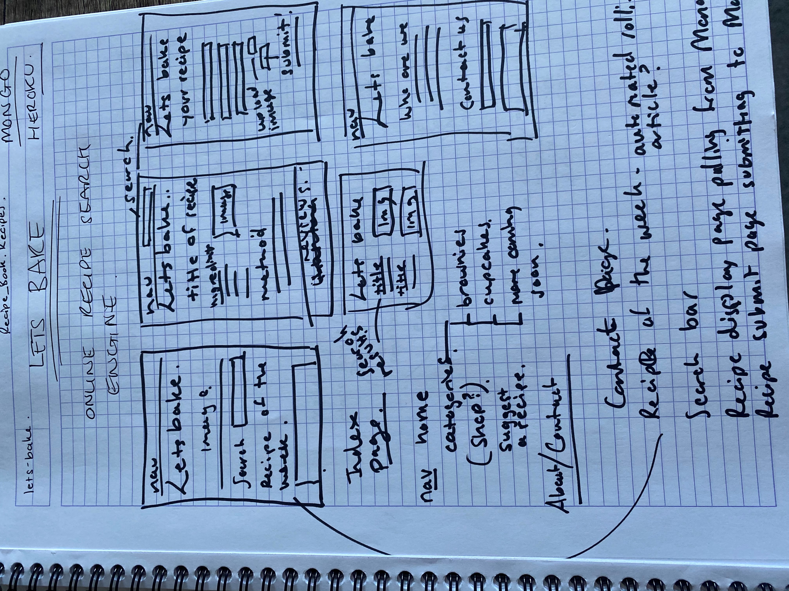
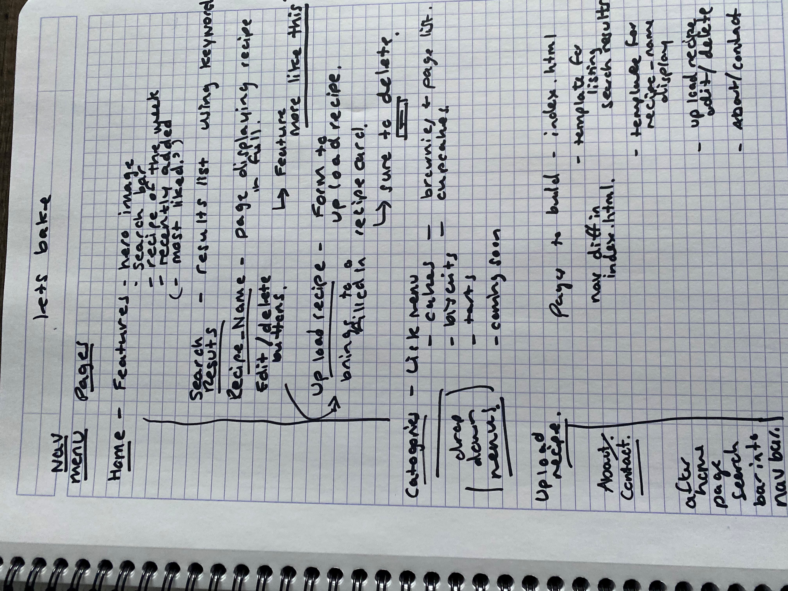

# LETS BAKE

A recipe search engine for users to find, upload, edit and delete baking recipes.

## UX
This website is design for individuals looking for baking recipes and inspiration. Users will be able to search using keywords for recipes. Use a dropdown menu to browse categories of recipes, as well as upload, edit and delete their own recipes. This site will inspire users to get their mixing bowls out through a "Recipe of the Week" and "Recently Added"

## Features
In this section, you should go over the different parts of your project, and describe each in a sentence or so.

### Existing Features
Feature 1 - allows users X to achieve Y, by having them fill out Z
...
For some/all of your features, you may choose to reference the specific project files that implement them, although this is entirely optional.

In addition, you may also use this section to discuss plans for additional features to be implemented in the future:

### Features Left to Implement
Another feature idea

## Technologies Used
Python
Flask
MongoDb
PyMongo
Bootstrap
Html
CSS

Deployed in Heroku
Repository in GitHub
Built in PyCharm

## Testing

##Debugging
Debugging, during first master push to heroku I kept receiving an error that the app was crashing. Through thorough checking and trying different fixes 
it was eventually solve through using gunicorn in the profile and update the requirements.txt. This resolved the issue through trying different fixes I 
also found an article to Config Vars for Deploy-Specific Settings for Heroku [Read that Article here](https://blog.heroku.com/config-vars). This enabled 
me to secure the secret key without having it displayed anywhere in my code. Pretty cool.

After some issues connecting to MongoDB, I tried installing mongo engine, after some research I thought using a more advanced ODM would allow for more advanced operators to be used and to bring more structure 
to the project. However, on installing I found it had a bug that then wouldn't allow my python file to run, so I uninstalled it. And have continued to use pymongo 
instead. 

After finding a cool plug in for the ingredients user input, I installed node.js in order to use angular in the project. However, the set up required upgrading 
to a professional pycharm package and also it would seem I would need to start the project over. Although, the feature would have enhanced UX and been an nice 
addition to use another language the complexity and time to do this has caused me to abandon this idea for now. The feature was 
[a user input, showing the items added in a bubble list](https://codepen.io/gfrancesca/pen/gbpoxQ)

After lots of difficulty connecting to mongoDB. One issues was the versions of database now matching the version of pymongo. I found success from following tutorial from 
[Tech with Tim](https://www.youtube.com/watch?v=rE_bJl2GAY8). This "fix" actually caused more issues and with a lengthy session with a tutor we solve the issues, one issue 
was a capital R. After getting connected was then able to but the Mongo set up details in a secure env.py file to ensure the password is secure and to stop the database from
being tampered with.

## Deployment
Using Pycharm as a integrated development environment, had both some positive features and some negative. The set up to Heroku was challenging 
but once connected (see debugging) it worked perfectly with PyCharm pushing to Git and up to Heroku automatically.
I particularly like how PyCharm makes it a lot easier to keep committing and pushing to git, having the ease of the rollback feature also allowed
some quick resetting when something went wrong.

To set up in PyCharm was relatively straight forward. 
- PyCharm sets up the environmental file on set up using the python language.
- I used pip install to install the relative packages (see requirements file). 
- I created the requirements file and the Procfile (see debugging)
- I linked up the project to a new git repository via the PyCharm interface.
- In Heroku I created a new project and database name. I then linked them via Git to my PyCharm project. In Heroku I set up the secret Key in the 
settings/config vars (Config Vars for Deploy-Specific Settings for Heroku [Read that Article here](https://blog.heroku.com/config-vars). This enabled 
me to secure the secret key without having it displayed anywhere in my code.).
-I also ensured I had inputted which language I was using Python. Using git to add and commit the set up and the Procfile, I then
deployed into Heroku using Git push Heroku master. Heroku now updates automatically each time I push to Git.

- To connect to MongoDB the database used for this project also came with issues (see debugging). However, the final set up is working fully.
- Using the env.py file created by PyCharm, in that file I added an import for os. Then added the following code:

os.environ["Mongo_URI"] = "This is taken via MongoDB from using the connect feature in using database collection you want to connect to".
os.environ["SECRET_KEY"] = "Can be anything you want".
os.environ["MONGO_DBNAME"] = 'Your database name'.

- Then in main.py the following set up was required to both connect to MongoDB using PyMongo and to use the Flask framework.

import os
from env import env
import time
from flask import Flask, render_template, request
from flask_pymongo import PyMongo, pymongo
from bson.objectid import ObjectId

env = env

app = Flask(__name__)
app.config["MONGO_DBNAME"] = os.environ.get("MONGO_DBNAME")
app.config["MONGO_URI"] = os.environ.get("MONGO_URI")
app.config['SECRET_KEY'] = os.environ.get("SECRET_KEY")

mongo = PyMongo(app)

## Credits
### Content
The text for section Y was copied from the Wikipedia article Z
### Media
The photos used in this site were obtained from ...
### Acknowledgements
I received inspiration for this project 